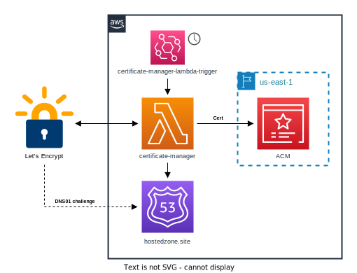

# Certificate manager Lambda

An AWS Lambda used to issue, track and refresh TLS certificates provided by [Let’s Encrypt](https://letsencrypt.org/).

## Infrastructure



## Usage

### Prerequisites

- A registered domain name
- DNS configuration hosted in Route53

### Adding a certificate

1. Navigate to the EventBridge config under [`config.json`](./config.json)
2. Add a new entry within the `Targets` list
   1. make sure to complete `Id`, `Arn` and `Input` fields correctly
3. Update the EventBridge rule by running:
   ```console
   aws events put-targets --cli-input-json file://config.json
   ```

## Development

### Go clients

https://letsencrypt.org/docs/client-options/#libraries-go

https://go-acme.github.io/lego/

## Author

[Thomas Bunyan](https://github.com/thomasbunyan)

## License

Copyright © 2022 [Thomas Bunyan](https://github.com/thomasbunyan).

Usage is provided under the MIT License.
